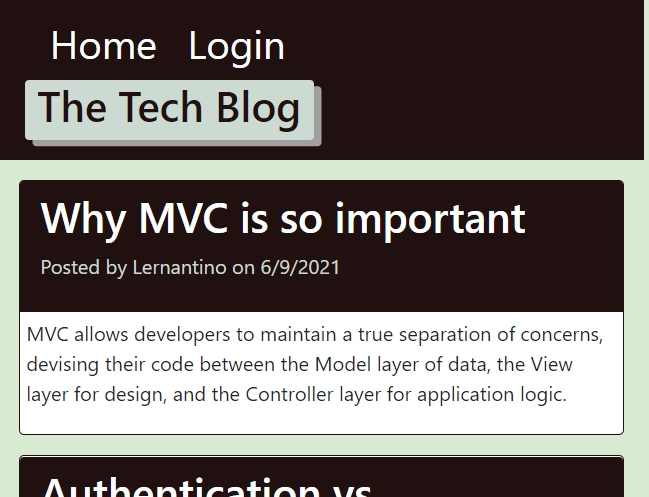
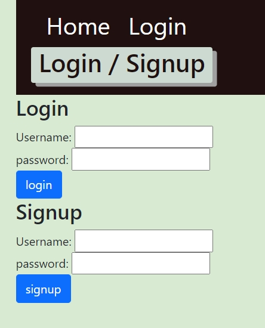
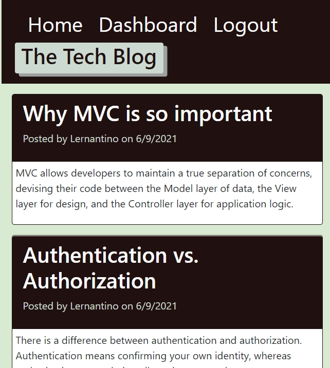
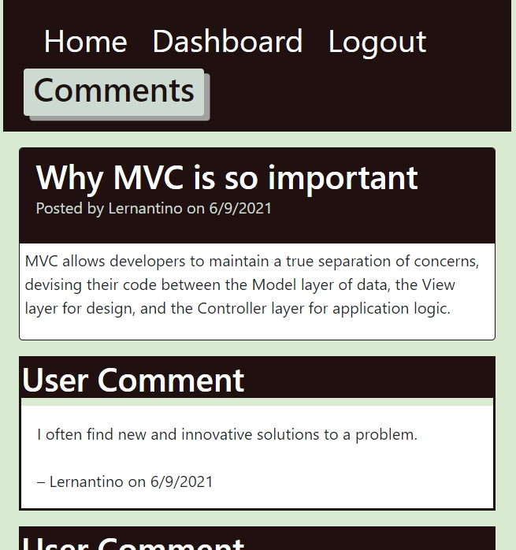
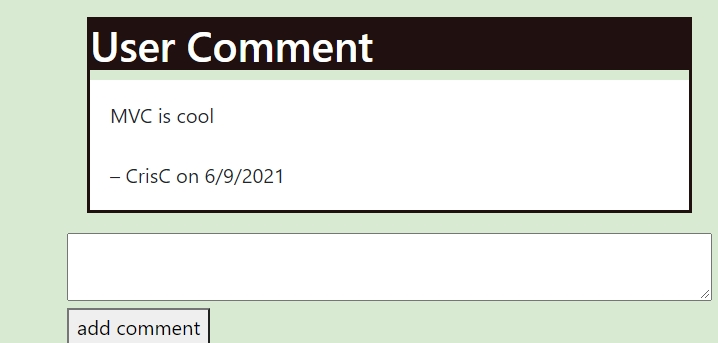
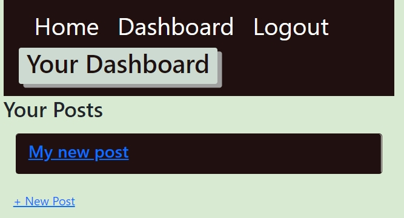
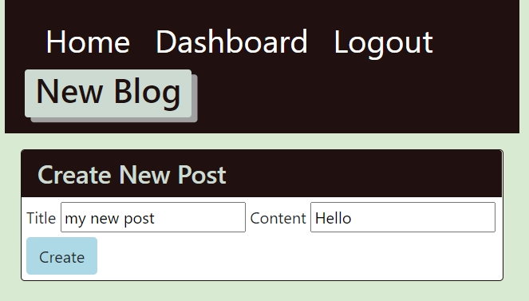
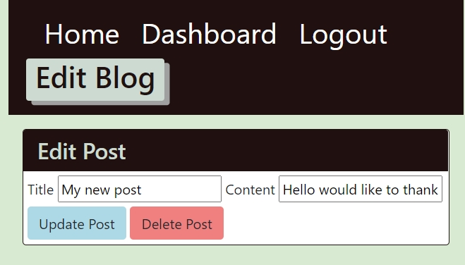

# Tech Blog

## Licensing:

#### Table of Contents
1. [Description](#description)
2. [Installation](#installation)
3. [Usage](#usage)
4. [Contributing](#contributing)
5. [Tests](#tests)
6. [Links](#links)
7. [Questions](#questions)

## Description
Website to read and write about technical concepts, recent advancements, and new technologies.

## Installation
nodeJS  
MySQL and Workbench  
npm install  
Add .env file at the same level as server.js  
Update .env  
- DB_USER='Username'  
- DB_PW='Password'  
- DB_NAME='ecommerce_db'  

npm run seed  
npm start

## Usage
1. Download repository.
2. Add .env file at the same folder directory as server.js file.
3. Open PowerShell/Bash, navigate in PowerShell/Bash into the downloaded repository folder.
4. Run "npm install", then "npm run seed", follow up by "npm start" or "node server.js".

## Contributing
This is open source project. Feel free to contribute😊.  

## Tests
Run "npm start" or "node server.js" in the PowerShell/Bash.

## Screenshots
  
  
  
  
  
  
  
  

## Links
  
Live/Production = https://techblogc3.herokuapp.com/ 
Repository = https://github.com/CrisC3/TechBlog  

## Questions
For any questions, you can contact:  
Github = https://github.com/CrisC3  
Email  = Cristobal.Canales@gmail.com